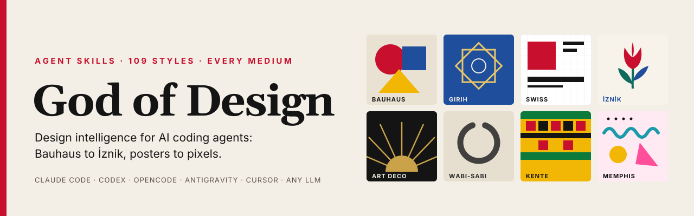
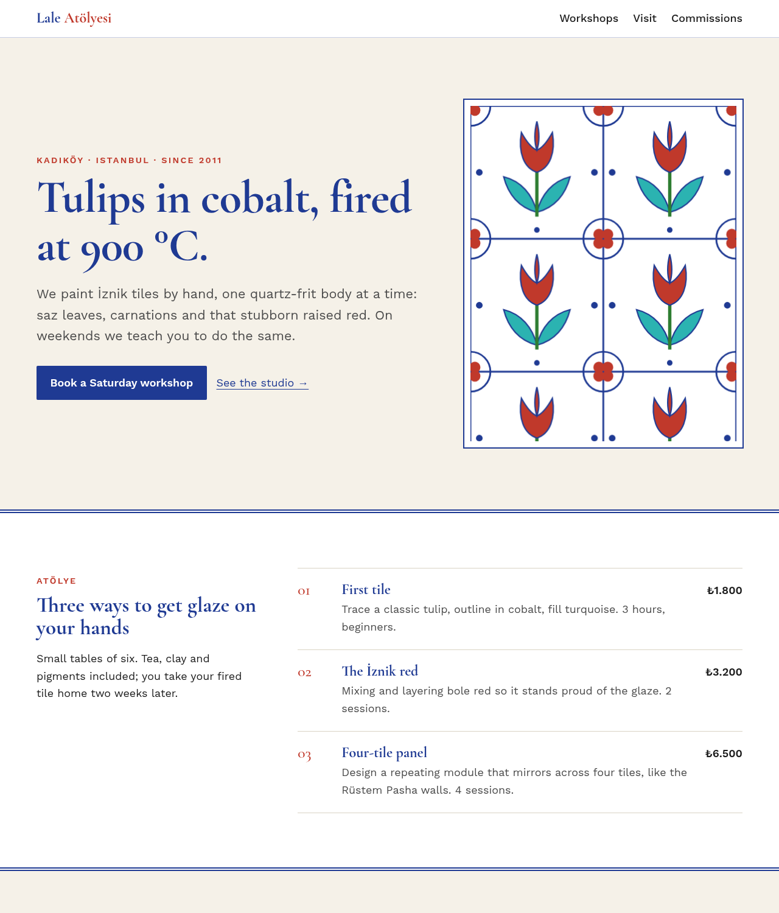

<p align="center">
  
</p>

<p align="center">
  <a href="README.md"></a>
  <a href="README.tr.md"></a>
</p>

<p align="center">
  <a href="#-quick-start"><b>Quick start</b></a>
  &nbsp;·&nbsp;
  <a href="#-installation"><b>Install</b></a>
  &nbsp;·&nbsp;
  <a href="#-uninstall"><b>Uninstall</b></a>
  &nbsp;·&nbsp;
  <a href="#-skills"><b>Skills</b></a>
  &nbsp;·&nbsp;
  <a href="#-style-atlas-109-styles"><b>Style atlas</b></a>
  &nbsp;·&nbsp;
  <a href="#-usage-examples-by-design-area"><b>Examples</b></a>
  &nbsp;·&nbsp;
  <a href="docs/research/benchmark-50-repos.md"><b>Benchmark</b></a>
  &nbsp;·&nbsp;
  <a href="#-faq"><b>FAQ</b></a>
</p>

<p align="center">
  <a href="https://github.com/cumabozkurt/god-of-design/actions/workflows/ci.yml"></a>
  
  
  
  
  
  <a href="LICENSE"></a>
  <a href="https://github.com/cumabozkurt/god-of-design/stargazers"></a>
</p>

<h3 align="center">Give your AI coding agent the eye of a senior designer, in any style from any culture, for every medium.</h3>

**God of Design** is an open-source pack of **19 Agent Skills** that adds design intelligence to Claude Code, OpenAI Codex CLI, OpenCode, Google Antigravity, Cursor, Gemini CLI, GitHub Copilot, Windsurf, Cline, and any LLM you can paste Markdown into. Instead of the same purple gradient and three identical cards, your agent gets a working method (brief → direction → system → build → critique), a **109-style atlas** that runs from Swiss and Bauhaus to Ottoman İznik, Kente, Madhubani, wabi-sabi, Y2K and liquid glass, and exact rules for colour, typography, layout, accessibility, social media, print, branding, slides, motion, data viz and image prompts. Each skill ends with an anti-slop gate and a scored review.

One canonical source, thin adapters per tool, a one-line installer, and a one-line uninstaller that removes **only** what it installed.

---

## 📑 Contents

- [💡 Why God of Design?](#-why-god-of-design)
- [✨ Features](#-features)
- [🧰 Supported tools](#-supported-tools)
- [🚀 Quick start](#-quick-start)
- [📥 Installation](#-installation)
- [🗑️ Uninstall](#️-uninstall)
- [⚙️ CLI reference](#️-cli-reference)
- [🧠 Skills](#-skills)
- [⌨️ Slash commands](#️-slash-commands)
- [🎨 Style atlas (109 styles)](#-style-atlas-109-styles)
- [🖌️ Usage examples by design area](#️-usage-examples-by-design-area)
- [🌍 Usage examples by style](#-usage-examples-by-style)
- [👀 Example output](#-example-output)
- [🔄 How it works](#-how-it-works)
- [🛡️ Quality gates](#️-quality-gates)
- [📁 Repository structure](#-repository-structure)
- [📊 Benchmark: 52 repos studied](#-benchmark-52-repos-studied)
- [❓ FAQ](#-faq)
- [🤝 Contributing](#-contributing)
- [📄 License](#-license)

---

## 💡 Why God of Design?

Before writing a line, we studied the **52 most relevant open-source repos** (design skills, agent-skill collections, cursor-rules lists, DESIGN.md/AGENTS.md standards, prompt libraries, about 2.1 million stars combined) by reading their READMEs and file trees. The full table with real star counts is in the [benchmark](docs/research/benchmark-50-repos.md) ([Türkçe özet](docs/research/benchmark-50-repos.tr.md)). Five gaps stood out, and this repo is built to close them:

| Gap in existing packs | What God of Design does |
|---|---|
| Web UI only. Nothing on print, social formats, logos and slides *together* | **Every medium:** UI/UX, mobile, social media (all platform sizes), posters and print (bleed, CMYK, paper sizes), logos and brand systems, decks, motion, data viz, illustration and image-gen prompts |
| Style lists are recent digital trends | **Design history and world cultures:** 24 art movements, 22 digital/UI styles, 18 retro/subcultures, **45 world traditions** (Islamic geometric, Ottoman İznik, tezhip, ebru, kilim, Persian, Mughal, Madhubani, batik, Kente, Adinkra, Ndebele, Otomi, Andean, Polish poster, Nordic…), with a respectful-use protocol |
| "Make it look good" with vague adjectives | Exact values: hex palettes, real Google Fonts names (each one verified against the Google Fonts API), grid specs, Tailwind/CSS hints and prompt fragments for every style |
| AI slop is mentioned but not tested | A dedicated `god-anti-slop` skill with tells, fixes and a pass/fail gate, plus a 10-dimension scored rubric in `god-review` |
| Install guides that only say "copy this folder", with no uninstall | One-line `install.sh` / `install.ps1` / `npx` CLI, nine tools, global or per-project, a dry run, a manifest, and a clean uninstall. Tested on Linux, macOS and Windows in CI |

## ✨ Features

- 🧭 **Design director workflow.** `god-of-design` routes every request through brief → **one named direction** (or 2–3 distinct options for bigger projects) → tokens → build → anti-slop and review, so the agent commits to a point of view instead of averaging.
- 🎨 **109-style atlas.** Every entry has origin, visual DNA, a hex palette, Google Fonts, layout rules, motifs, do/don't, CSS/Tailwind hints and an image-gen prompt.
- 🌈 **Colour science.** Harmony schemes, 60-30-10, OKLCH scales, semantic roles, dark mode, colour-blind safety, cultural colour meanings, plus a **WCAG contrast checker script** (`contrast.mjs`).
- 🔤 **Typography.** Modular scales, fluid `clamp()` type, **60 vetted Google Fonts pairings**, and multi-script setting (Arabic/Persian RTL, CJK, Devanagari, Thai, Cyrillic, Turkish ğ ş ı İ).
- 📐 **Layout and composition.** Column, modular and baseline grids, spacing scales, hierarchy, Gestalt, golden ratio and rule of thirds, with responsive breakpoints.
- 🧩 **UI/UX.** Landing pages, SaaS dashboards, forms, navigation, states, component specs, microcopy, conversion patterns, and iOS (HIG) / Material 3 mobile.
- 🪙 **Design tokens.** W3C DTCG JSON, primitive → semantic → component layers, CSS variables, a Tailwind v4 `@theme`, and a `DESIGN.md` template.
- ♿ **Accessibility to WCAG 2.2 AA.** Contrast, focus, keyboard, semantics, motion, touch targets and forms.
- 📱 **Social media at exact specs.** Instagram, TikTok, YouTube, LinkedIn, X, Facebook, Pinterest, Threads and more: sizes, safe zones and carousel patterns.
- 🖨️ **Print and branding.** Posters, brochures, book covers, business cards, packaging, bleed/CMYK/DPI, logo construction and brand guidelines.
- 🎤 **Presentations, motion, data viz.** Deck narratives, slide grids, easing and duration tokens, `prefers-reduced-motion`, chart selection and dashboards.
- 🖼️ **Image-generation prompting.** Midjourney, GPT Image, Gemini/Imagen, FLUX, Stable Diffusion and Ideogram, with a prompt library per style.
- 🚫 **Anti-slop and review.** The tells of machine-made design, each with a fix, and a scored critique before handover.
- 📦 **Output recipes.** Production HTML/CSS, Tailwind, React/Next.js + shadcn/ui, SVG, Playwright PNG/PDF rendering (`render.mjs`), and Figma/Canva handoff.
- 🔌 **Cross-tool by design.** Native skill folders, rule files, AGENTS.md/GEMINI.md blocks, plugin marketplaces, and single-file bundles for any LLM.
- 🧹 **Reversible install.** A manifest records every file. Uninstall removes only those files and leaves your own skills and instructions byte-identical (tested).

## 🧰 Supported tools

| Tool | What gets installed | Global (`--global`, default) | Project (`--project`) | How you use it |
|---|---|---|---|---|
| **Claude Code** | 19 skills + 7 slash commands | `~/.claude/skills`, `~/.claude/commands` | `.claude/skills`, `.claude/commands` | Skills auto-activate; `/god-design …`; or the plugin marketplace |
| **OpenAI Codex CLI** | 19 skills + AGENTS.md block | `~/.agents/skills`, `~/.codex/AGENTS.md` | `.agents/skills`, `AGENTS.md` | `$god-of-design`, `/skills`, or just ask |
| **OpenCode** | Skills + 7 commands | `~/.config/opencode/skills` (also reads `~/.claude/skills`, `~/.agents/skills`), `~/.config/opencode/commands` | `.opencode/skills`, `.opencode/commands` | Skills auto-load; `/god-design …` |
| **Google Antigravity** | Skills (+ workspace rule) | `~/.gemini/config/skills` | `.agents/skills`, `.agents/rules/god-of-design.md` | Skills activate from their descriptions |
| **Gemini CLI** | Skills (+ GEMINI.md block) | `~/.gemini/skills` (also reads `~/.agents/skills`) | `.gemini/skills`, `GEMINI.md` | `/skills`, or just ask |
| **Cursor** | Skills + rule | `~/.cursor/skills` (also reads `~/.agents/skills`, `~/.claude/skills`) | `.cursor/skills`, `.cursor/rules/god-of-design.mdc` | Agent picks skills up; `@god-of-design` rule |
| **GitHub Copilot** | Skills + instructions | `~/.copilot/skills` | `.github/skills`, `.github/instructions/god-of-design.instructions.md` | Copilot agent mode / Chat |
| **Windsurf** | Rule (≤ 6 000 chars) + full reference bundle | block in `~/.codeium/windsurf/memories/global_rules.md` | `.windsurf/rules/god-of-design.md` | Cascade follows the rule and opens the bundle when needed |
| **Cline** | Rule + full reference bundle | `~/Documents/Cline/Rules/god-of-design.md` | `.clinerules/god-of-design.md` | Always-on rule |
| **Any LLM** (ChatGPT, Gemini web, Claude.ai, local models) | Paste a single file | [`dist/GOD-OF-DESIGN.md`](dist/GOD-OF-DESIGN.md) (full, ~220 KB) · [`dist/GOD-OF-DESIGN-LITE.md`](dist/GOD-OF-DESIGN-LITE.md) (~8 KB) · [`llms.txt`](llms.txt) | | Upload as a file or paste as a system prompt |

> **Default `--tool all`** installs to `~/.claude/skills` (Claude Code), `~/.agents/skills` (Codex, and also read by Cursor, Gemini CLI and OpenCode), `~/.gemini/config/skills` (Antigravity), and adds the slash commands for Claude Code and OpenCode. Three folders cover nine tools without a separate copy per tool. Paths were checked against each tool's official docs on 2026-10-03; run `god-of-design list tools` to see them.

## 🚀 Quick start

**macOS / Linux**

```bash
curl -fsSL https://raw.githubusercontent.com/cumabozkurt/god-of-design/main/install.sh | bash
```

**Windows (PowerShell)**

```powershell
irm https://raw.githubusercontent.com/cumabozkurt/god-of-design/main/install.ps1 | iex
```

**Anywhere with Node ≥ 18**

```bash
npx github:cumabozkurt/god-of-design install
```

Then restart your agent and ask:

```text
Design a landing page for an Istanbul ceramics studio in Ottoman İznik style.
```

## 📥 Installation

Every installer accepts the same options: pick tools with `--tool` (comma-separated), choose `--global` (default, your user folders) or `--project` (the current repo, so you can commit it for your team), and preview with `--dry-run`.

<details open>
<summary><b>One-line installers with options</b></summary>

```bash
# Only Cursor and Windsurf, into the current project
curl -fsSL https://raw.githubusercontent.com/cumabozkurt/god-of-design/main/install.sh | bash -s -- --tool cursor,windsurf --project

# Every tool's native folder (maximum coverage)
curl -fsSL https://raw.githubusercontent.com/cumabozkurt/god-of-design/main/install.sh | bash -s -- --tool every

# See what would happen without writing anything
curl -fsSL https://raw.githubusercontent.com/cumabozkurt/god-of-design/main/install.sh | bash -s -- --dry-run

# Pin a version (tag or branch)
curl -fsSL https://raw.githubusercontent.com/cumabozkurt/god-of-design/main/install.sh | GOD_OF_DESIGN_REF=v1.0.0 bash
```

```powershell
# PowerShell with options
& ([scriptblock]::Create((irm https://raw.githubusercontent.com/cumabozkurt/god-of-design/main/install.ps1))) install -Tool claude,codex -Project
```

</details>

<details>
<summary><b>Node CLI (npx)</b></summary>

```bash
npx github:cumabozkurt/god-of-design install --tool claude,codex,opencode
npx github:cumabozkurt/god-of-design list styles
npx github:cumabozkurt/god-of-design status
```

Or install the CLI globally from GitHub: `npm i -g github:cumabozkurt/god-of-design`, then run `god-of-design install`. The CLI has zero dependencies.
</details>

<details>
<summary><b>Claude Code: plugin marketplace</b></summary>

```text
/plugin marketplace add cumabozkurt/god-of-design
/plugin install god-of-design@god-of-design
```

Skills installed as a plugin are namespaced, for example `/god-of-design:god-design`. Update with `/plugin marketplace update god-of-design`.
</details>

<details>
<summary><b>OpenAI Codex: plugin</b></summary>

```bash
codex plugin marketplace add cumabozkurt/god-of-design
codex plugin add god-of-design@god-of-design
```

Or use the one-line installer, which writes to `~/.agents/skills` and adds a short block to `~/.codex/AGENTS.md`. Call skills with `$god-of-design` or `/skills`.
</details>

<details>
<summary><b>OpenCode</b></summary>

```bash
curl -fsSL https://raw.githubusercontent.com/cumabozkurt/god-of-design/main/install.sh | bash -s -- --tool opencode
```

This installs skills to `~/.config/opencode/skills` and the `/god-*` commands to `~/.config/opencode/commands`. OpenCode also reads `~/.claude/skills` and `~/.agents/skills`, so the default `all` install already works.
</details>

<details>
<summary><b>Google Antigravity</b></summary>

```bash
curl -fsSL https://raw.githubusercontent.com/cumabozkurt/god-of-design/main/install.sh | bash -s -- --tool antigravity            # ~/.gemini/config/skills
curl -fsSL https://raw.githubusercontent.com/cumabozkurt/god-of-design/main/install.sh | bash -s -- --tool antigravity --project  # .agents/skills + .agents/rules/
```

Antigravity loads Agent Skills from `~/.gemini/config/skills` (global) and `.agents/skills` (workspace), and reads rules from `.agents/rules/`. Workflows are deprecated in favour of skills, so the pack ships as skills.
</details>

<details>
<summary><b>Cursor, Gemini CLI, Copilot, Windsurf, Cline</b></summary>

```bash
curl -fsSL https://raw.githubusercontent.com/cumabozkurt/god-of-design/main/install.sh | bash -s -- --tool cursor --project    # .cursor/skills + .cursor/rules/god-of-design.mdc
curl -fsSL https://raw.githubusercontent.com/cumabozkurt/god-of-design/main/install.sh | bash -s -- --tool gemini             # ~/.gemini/skills
curl -fsSL https://raw.githubusercontent.com/cumabozkurt/god-of-design/main/install.sh | bash -s -- --tool copilot --project   # .github/skills + .github/instructions/
curl -fsSL https://raw.githubusercontent.com/cumabozkurt/god-of-design/main/install.sh | bash -s -- --tool windsurf           # global_rules.md block + ~/.god-of-design/GOD-OF-DESIGN.md
curl -fsSL https://raw.githubusercontent.com/cumabozkurt/god-of-design/main/install.sh | bash -s -- --tool cline              # ~/Documents/Cline/Rules/god-of-design.md
```

The repo also ships a `gemini-extension.json`, so Gemini CLI can load it as an extension (`gemini extensions install https://github.com/cumabozkurt/god-of-design`). This puts the routing rules from `GEMINI.md` into context. For the full skills, use the installer above.
</details>

<details>
<summary><b>Other routes: npx skills, git clone, any LLM</b></summary>

```bash
# vercel-labs/skills installer (the repo uses the standard skills/ layout)
npx skills add cumabozkurt/god-of-design

# From a clone (installers use the local files, no download)
git clone https://github.com/cumabozkurt/god-of-design && cd god-of-design
./install.sh --tool all            # or: node bin/god-of-design.mjs install
```

**Any LLM without skills support:** upload [`dist/GOD-OF-DESIGN.md`](dist/GOD-OF-DESIGN.md) (or paste [`dist/GOD-OF-DESIGN-LITE.md`](dist/GOD-OF-DESIGN-LITE.md) / [`adapters/generic/SYSTEM-PROMPT.md`](adapters/generic/SYSTEM-PROMPT.md) as the system prompt).
</details>

**Verify:** run `god-of-design status` (or `./install.sh status`). In Claude Code, type `/` and look for `god-design`. In Codex, run `/skills`. In OpenCode, run `opencode debug skill`.

## 🗑️ Uninstall

```bash
# macOS / Linux
curl -fsSL https://raw.githubusercontent.com/cumabozkurt/god-of-design/main/install.sh | bash -s -- uninstall
curl -fsSL https://raw.githubusercontent.com/cumabozkurt/god-of-design/main/install.sh | bash -s -- uninstall --project   # project install
```

```powershell
# Windows
& ([scriptblock]::Create((irm https://raw.githubusercontent.com/cumabozkurt/god-of-design/main/install.ps1))) uninstall
```

```bash
# Node
npx github:cumabozkurt/god-of-design uninstall            # add --project for a project install
```

**What uninstall does:** it reads the manifest (`~/.god-of-design/manifest.tsv` or `./.god-of-design/manifest.tsv`) and removes only the paths listed there. It skips any skill folder that is not marked `pack: god-of-design`, deletes only the text between `<!-- god-of-design:start -->` and `<!-- god-of-design:end -->` in AGENTS.md / GEMINI.md / global_rules.md (and deletes the file only if the installer created it and it is now empty), and removes only directories it created that are now empty. All three installers share the manifest format, so you can install with `curl | bash` and uninstall with `npx`, or the other way round. Our tests check that HOME is byte-identical after an install → uninstall round trip.

## ⚙️ CLI reference

| Command | What it does |
|---|---|
| `install` | Install (default `--tool all --global`). Re-running performs a clean upgrade: it uninstalls the previous manifest first |
| `uninstall` | Remove exactly what the manifest lists (`--project` for project installs) |
| `status` | Show global and project installs: version, tools, item count |
| `list [skills\|styles\|tools]` | Print skills, the 109 styles by family, or every tool's paths (Node CLI) |

| Option | Node CLI / install.sh | install.ps1 | Meaning |
|---|---|---|---|
| Tools | `--tool all\|every\|claude,codex,…` | `-Tool` | `all` = recommended dedupe set, `every` = every tool's native folders |
| Scope | `--global` (default) / `--project` | `-Project` | User folders vs. the current repo |
| Directory | `--dir PATH` | `-Dir PATH` | Project root (default: current directory) |
| Preview | `--dry-run` | `-DryRun` | Show actions, write nothing |
| Overwrite | `--force` | `-Force` | Replace same-named folders that are not ours (off by default) |
| No instruction edits | `--no-instructions` | `-NoInstructions` | Don't touch AGENTS.md / GEMINI.md / global_rules.md |

Environment variables: `GOD_OF_DESIGN_REF` (git ref to download), `GOD_OF_DESIGN_HOME` (alternate home, used by tests), `CODEX_HOME`, `XDG_CONFIG_HOME`, `NO_COLOR`.

## 🧠 Skills

| Skill | Use it for |
|---|---|
| [`god-of-design`](skills/god-of-design/SKILL.md) | **Start here.** Design director and router: 5-step workflow, routing table, quick commands |
| [`god-styles`](skills/god-styles/SKILL.md) | The 109-style atlas, style mixing, choosing a style for a brief, respectful use of cultural styles |
| [`god-color`](skills/god-color/SKILL.md) | Palettes, harmony, OKLCH scales, semantic roles, dark mode, contrast math, cultural colour meaning (+ `contrast.mjs`) |
| [`god-typography`](skills/god-typography/SKILL.md) | Type scales, 60 Google Fonts pairings, fluid type, multi-script and Turkish support |
| [`god-layout`](skills/god-layout/SKILL.md) | Grids, spacing, hierarchy, composition, responsive layout |
| [`god-ui-ux`](skills/god-ui-ux/SKILL.md) | Landing pages, SaaS, dashboards, forms, components, states, microcopy |
| [`god-mobile`](skills/god-mobile/SKILL.md) | iOS HIG (Liquid Glass era), Material 3, React Native/Flutter, touch and gestures |
| [`god-tokens`](skills/god-tokens/SKILL.md) | W3C DTCG tokens, CSS variables, Tailwind v4 `@theme`, `DESIGN.md` |
| [`god-accessibility`](skills/god-accessibility/SKILL.md) | WCAG 2.2 AA: contrast, keyboard, focus, semantics, motion, forms |
| [`god-social-media`](skills/god-social-media/SKILL.md) | Exact specs and safe zones for every platform, carousels, thumbnails, content patterns |
| [`god-print`](skills/god-print/SKILL.md) | Posters, flyers, brochures, book covers, cards, packaging, bleed/CMYK/DPI/paper sizes |
| [`god-branding`](skills/god-branding/SKILL.md) | Brand strategy, logo construction, identity systems, guidelines |
| [`god-presentations`](skills/god-presentations/SKILL.md) | Deck narratives, slide grids, pitch decks, speaker-friendly design |
| [`god-motion`](skills/god-motion/SKILL.md) | Micro-interactions, transitions, scroll effects, easing/duration tokens, reduced motion |
| [`god-dataviz`](skills/god-dataviz/SKILL.md) | Chart choice, dashboards, infographics, accessible data colour |
| [`god-imagegen`](skills/god-imagegen/SKILL.md) | Prompts for Midjourney, GPT Image, Imagen, FLUX, SD, Ideogram; style prompt library |
| [`god-anti-slop`](skills/god-anti-slop/SKILL.md) | Detect and fix generic "AI-made" design and copy; the pre-delivery gate |
| [`god-review`](skills/god-review/SKILL.md) | 10-dimension scored critique and quality audit |
| [`god-output`](skills/god-output/SKILL.md) | HTML/CSS, Tailwind, React/shadcn, SVG, PNG/PDF render (`render.mjs`), Figma/Canva handoff |

## ⌨️ Slash commands

Installed for Claude Code and OpenCode. In other tools, just say the same thing in plain words.

| Command | Example |
|---|---|
| `/god-design <brief>` | `/god-design pricing page for a Turkish e-invoice SaaS` |
| `/god-directions <brief>` | `/god-directions rebrand for a 40-year-old Kadıköy bakery` (3 distinct directions) |
| `/god-style <style> [to <target>]` | `/god-style bauhaus to conference poster A2` |
| `/god-social <platform> <format> <topic>` | `/god-social instagram carousel 5 tips for saving energy` |
| `/god-audit <file or url>` | `/god-audit src/app/page.tsx` (slop + a11y + review) |
| `/god-polish <file>` | `/god-polish index.html` (fix spacing, type, contrast, states) |
| `/god-export-tokens [styles path or brand]` | `/god-export-tokens src/app/globals.css` (DTCG JSON, CSS vars, Tailwind v4 `@theme`, DESIGN.md) |

## 🎨 Style atlas (109 styles)

Full entries: [`skills/god-styles/references/`](skills/god-styles/references/00-index.md). Each style gives origin · DNA · hex palette · Google Fonts · layout · motifs · do/don't · CSS/Tailwind · image prompt.

<details open>
<summary><b>Art & design movements (24)</b></summary>

Arts and Crafts · Art Nouveau · Vienna Secession · Art Deco · Streamline Moderne · Bauhaus · De Stijl · Russian Constructivism · Italian Futurism · Dada & Collage · Surrealism · Swiss / International Typographic Style · Mid-Century Modern · Pop Art · Op Art · Psychedelic 60s · Seventies Retro · Memphis Design · Postmodern / New Wave Typography · Punk / DIY Zine · Grunge / Ray Gun Era · Minimalism · Maximalism · Victorian / Letterpress
</details>

<details open>
<summary><b>Digital & UI styles (22)</b></summary>

Flat Design · Material Design 3 · Skeuomorphism · Neumorphism · Glassmorphism · Liquid Glass · Claymorphism · Web Brutalism · Neo-Brutalism · Bento Grid · Dark Tech / Linear Style · Aurora / Mesh Gradient · Editorial / Magazine Web · Corporate Memphis · Isometric & 3D · Organic / Biophilic · Spatial UI · Retro OS (Windows 95 / Mac OS 9) · Industrial Monochrome · Terminal / Data-Dense · Kinetic Typography · AI-Native / Conversational UI
</details>

<details open>
<summary><b>Retro, internet & subculture (18)</b></summary>

Y2K · Frutiger Aero · Vaporwave · Synthwave / Outrun · Cyberpunk · Solarpunk · Steampunk · Pixel Art / 8-bit · Risograph / Lo-fi Print · Rave / Acid Graphics · Dark Academia · Cottagecore · Kawaii · Anime / Manga · Blackletter / Gothic · Grain & Tactile Texture · Vintage Americana / Diner · Tiki / Mid-century Tropical
</details>

<details open>
<summary><b>World traditions (45)</b></summary>

- **East Asia:** Wabi-sabi & Ma · Ukiyo-e · Wagara patterns · Japanese modern graphic design · Chinese ink wash · Chinese festive & imperial · Shanghai Deco · Korean Dancheong & Obangsaek · Korean minimal (Joseon white, hanji)
- **Islamic world, Türkiye & Persia:** Islamic geometric · Arabic calligraphic · Moroccan zellige · **Ottoman İznik tiles** · **Ottoman tezhip & hat** · **Turkish ebru (marbling)** · **Anatolian kilim** · Persian miniature & Safavid
- **South & Southeast Asia:** Mughal · Madhubani · Indian block print · Bollywood hand-painted poster · South Asian truck art · Indonesian batik · Thai traditional (Lai Thai)
- **Africa:** Kente · Adinkra · Ndebele · Bògòlanfini (mudcloth) · Ethiopian (Ge'ez manuscript & tilet) · Afrofuturism
- **Latin America:** Otomi / Tenango · Papel picado & Día de Muertos · Mexican muralism · Andean textile · Brazilian modernism & Tropicália · Cuban poster (ICAIC)
- **Europe:** Scandinavian / Nordic minimal · Finnish bold pattern · Slavic folk · Polish poster school · Celtic knotwork · Mediterranean / Greek
- **Indigenous (with protocol):** Aboriginal Australian · Māori & Pacific · Native American / First Nations

> The world-traditions file opens with a **respectful-use protocol**: name the culture precisely, never reproduce sacred or restricted designs, prefer inspiration over imitation for living traditions, and recommend commissioning artists from that community for commercial work.
</details>

## 🖌️ Usage examples by design area

Plain-language prompts work in every tool. The router picks the right skills.

| Area | Prompt |
|---|---|
| **Landing page** | "Design and build a landing page for a Turkish olive-oil subscription. Give me 3 directions first, then build the chosen one in Next.js + Tailwind." |
| **Dashboard / SaaS** | "Redesign this analytics dashboard (`app/dashboard/page.tsx`) for density and clarity. Dark mode included, WCAG AA." |
| **Design system** | "Create a token system (DTCG JSON + Tailwind v4 theme) from our brand colour #0F766E, with light/dark semantic roles and a DESIGN.md." |
| **Mobile app** | "Design the onboarding flow for an iOS meditation app in the Liquid Glass era; then the Material 3 Android equivalent." |
| **Social media** | "Make a 7-slide Instagram carousel (1080×1350) explaining compound interest, Swiss style, with safe zones respected. Output HTML I can export to PNG." |
| **YouTube / TikTok** | "Three YouTube thumbnail concepts (1280×720) for 'I built a house in 30 days', plus a 9:16 TikTok cover." |
| **Poster / print** | "A2 jazz-festival poster in Polish poster-school style, 3 mm bleed, CMYK-safe palette, SVG + print-ready PDF." |
| **Logo & brand** | "Logo directions for 'Kuzu Coffee' (wordmark, monogram, symbol), the construction grid, and a one-page brand guideline." |
| **Presentation** | "A 12-slide seed pitch deck for a climate-tech startup, editorial style, one idea per slide, with speaker notes." |
| **Motion** | "Add tasteful micro-interactions to this form: focus, validation and success. Respect prefers-reduced-motion." |
| **Data viz** | "Pick the right chart for monthly churn by cohort and build it accessibly (colour-blind safe, labelled, no legend hunting)." |
| **Image generation** | "Write Midjourney and GPT Image prompts for a hero illustration in Madhubani style, a family cooking together, 16:9." |
| **Audit** | "Audit our homepage for AI slop and accessibility, score it with the review rubric, then fix the top 5 issues." |
| **Handoff** | "Turn this page into a Figma-ready spec (frames, auto-layout, tokens) and a Canva brief for the marketing team." |

## 🌍 Usage examples by style

| Style | Prompt |
|---|---|
| Swiss / International | "Conference website in strict Swiss style: 12-column grid, flush-left Inter Tight, one red accent, no decoration." |
| Bauhaus | "Bauhaus-style event poster for a design school open day, primary colours and geometric shapes, A3." |
| Art Nouveau | "Art Nouveau label for a botanical gin: whiplash curves, Mucha-like frame, Cormorant + Poiret One." |
| Art Deco | "Art Deco hotel menu, gold on black, sunburst motifs, Poiret One headings." |
| Memphis | "Memphis-style birthday invite for a 30th, squiggles and confetti shapes, loud but legible." |
| Neo-brutalism | "Neo-brutalist pricing section: thick black borders, hard offset shadows, Space Grotesk." |
| Glassmorphism / Liquid Glass | "Weather widget in Liquid Glass style with readable text on solid layers and a reduced-transparency fallback." |
| Wabi-sabi & Ma | "Tea-house website using ma (negative space), wabi-sabi textures and Shippori Mincho." |
| Ottoman İznik | "Instagram post series for a Kapadokya hotel in İznik tile style, cobalt/turquoise/İznik red on white." |
| Islamic geometric | "An SVG 8-fold girih pattern background for a Ramadan campaign, accessible text overlay." |
| Kente / Adinkra | "Brand pattern for a Ghanaian-owned fintech inspired by Kente structure. Explain the colour meanings and what to avoid." |
| Madhubani | "Children's book cover in Madhubani style with double-line borders and natural pigments palette." |
| Polish poster school | "Film-festival poster in Polish poster-school style: hand-painted metaphor, expressive lettering." |
| Y2K / Vaporwave / Cyberpunk | "Y2K chrome landing page for a music app; then a cyberpunk variant with neon on near-black." |
| Scandinavian | "Nordic minimal e-commerce product page: soft neutrals, generous whitespace, one warm accent." |

## 👀 Example output

[`examples/iznik-ceramics-landing/`](examples/iznik-ceramics-landing/index.html) shows the workflow applied to *"landing page for an Istanbul ceramics studio, Ottoman İznik style"*. It uses the atlas palette with contrast checked by `contrast.mjs` (cobalt on white 10.1:1), Cormorant Garamond + Work Sans (both support Turkish characters), an asymmetric 7/5 hero, a real repeating 4-tile SVG module, an editorial numbered list instead of three identical cards, visible focus states and reduced-motion support.

<p align="center"></p>

## 🔄 How it works

```text
           your request ("poster", "dashboard", "carousel", "logo"…)
                                  │
                         ┌────────▼────────┐
                         │  god-of-design  │  router + 5-step workflow
                         └────────┬────────┘
   1 Brief ─► 2 Direction (1 named, or 2–3 options) ─► 3 System (tokens) ─► 4 Build ─► 5 Gate
                 │                      │                │               │
           god-styles            god-color         god-ui-ux/print/  god-anti-slop
           (109 styles)          god-typography    social/branding/  god-review
                                 god-layout        slides/motion/    god-accessibility
                                 god-tokens        dataviz/imagegen
                                                   god-output (HTML, Tailwind, React, SVG, PNG/PDF)
```

- **Progressive disclosure.** Each `SKILL.md` is short and loads deep references (`references/*.md`) only when needed, so the context window stays light.
- **One source, many adapters.** `skills/` is canonical. `npm run build` generates the Cursor/Windsurf/Cline/Copilot/Antigravity rule files, the Codex and Gemini snippets, `dist/GOD-OF-DESIGN*.md`, `llms.txt` and `catalog.json`.
- **Standard format.** Skills follow the open Agent Skills format (`name`, `description`, `license`, `compatibility`, `metadata`), which Claude Code, Codex, OpenCode, Cursor, Gemini CLI, Antigravity and Copilot all read.

## 🛡️ Quality gates

- **Anti-slop gate (`god-anti-slop`).** Bans the usual tells: purple→blue gradient heroes, gradient headline text, everything centred, a uniform 16px radius, floating blurred blobs, ✨/🚀 emoji as icons, Corporate Memphis people and 3D glossy blobs, "Unlock / Elevate / Supercharge" headlines and rule-of-three adjective stacks. Each comes with a concrete fix.
- **Review rubric (`god-review`).** Scores 10 dimensions from 0 to 10 with evidence: concept & direction, hierarchy, layout & spacing, typography, colour, imagery & iconography, consistency & system, usability & UX, accessibility, craft & polish. It then lists fixes as P0/P1/P2 with exact changes and re-scores after fixing.
- **Accessibility (`god-accessibility`).** WCAG 2.2 AA by default, with contrast numbers computed rather than guessed.
- **Repository CI.** On every push: frontmatter schema, `name` = folder, description ≤ 500 chars, internal links, style-entry completeness (11 fields, valid hex, unique IDs), JSON manifests, version consistency, script syntax, generated files up to date, and **installer round trips on Ubuntu, macOS and Windows** (Node CLI, install.sh, install.ps1 and every cross-installer pair).

## 📁 Repository structure

```text
god-of-design/
├── skills/                     # 19 Agent Skills (single source of truth)
│   ├── god-of-design/SKILL.md  # router + workflow
│   ├── god-styles/references/  # 109-style atlas (4 files + generated index)
│   ├── god-color/              # + references/, scripts/contrast.mjs
│   ├── god-typography/         # + references/font-pairings.md (60), multiscript.md
│   └── …                       # ui-ux, mobile, tokens, social-media, print, branding, …
├── commands/                   # 7 slash commands (Claude Code, OpenCode)
├── adapters/                   # generated rule files per tool + _core.md source
├── dist/                       # GOD-OF-DESIGN.md (full) + GOD-OF-DESIGN-LITE.md
├── bin/god-of-design.mjs       # zero-dependency Node CLI
├── install.sh · install.ps1    # one-line installers (shared manifest format)
├── scripts/build.mjs           # generates index, adapters, dist, llms.txt, catalog.json
├── scripts/validate.mjs        # CI validator
├── test/                       # node:test + bash + pwsh round-trip tests
├── examples/                   # example output (İznik landing page)
├── docs/research/              # 52-repo benchmark (EN + TR)
├── .claude-plugin/             # Claude Code plugin + marketplace
├── .codex-plugin/ · .agents/   # Codex plugin manifest + marketplace
├── gemini-extension.json       # Gemini CLI extension
├── llms.txt · catalog.json
└── AGENTS.md · CLAUDE.md · GEMINI.md
```

## 📊 Benchmark: 52 repos studied

We read the README and file tree of 52 related repos (star counts are real GitHub API values captured on 2026-10-03), including obra/superpowers (294,682 ★), anthropics/skills (179,479 ★), nextlevelbuilder/ui-ux-pro-max-skill (132,669 ★), VoltAgent/awesome-design-md (119,333 ★), Leonxlnx/taste-skill (92,190 ★), pbakaus/impeccable (74,660 ★) and PatrickJS/awesome-cursorrules (40,872 ★). Key takeaways:

1. **Opinion beats volume.** The most-loved design skills force a point of view and refuse defaults.
2. **Anti-slop must be explicit, testable and paired with fixes.**
3. **The gap is breadth.** No one covers *all media* (print, social, brand, slides) or *world cultures and design history*.
4. **Install must be one line, cross-tool and reversible.** Almost nobody documents uninstall.
5. **One canonical source and thin adapters, with tool paths re-verified often.** They move.

→ [Full benchmark table](docs/research/benchmark-50-repos.md) · [Türkçe özet](docs/research/benchmark-50-repos.tr.md)

## ❓ FAQ

<details>
<summary><b>Which tool should I pick for <code>--tool</code>?</b></summary>

Leave the default (`all`). It covers Claude Code, Codex, Antigravity, OpenCode, Cursor, Gemini CLI and Copilot through three shared folders. Add `--tool windsurf` or `--tool cline` for those editors, or use `--project --tool cursor` to commit the rules into a team repo.
</details>

<details>
<summary><b>Will it overwrite my existing skills, AGENTS.md or rules?</b></summary>

No. The installer skips any same-named folder that is not marked `pack: god-of-design` (unless you pass `--force`). In AGENTS.md / GEMINI.md / Windsurf global rules it only appends a block between `god-of-design:start/end` markers, and uninstall removes only that block. The tests check that your files are byte-identical after install → uninstall. One normalisation can happen: if your file lacked a trailing newline, it ends with exactly one afterwards.
</details>

<details>
<summary><b>Do I see the skills twice in OpenCode or Cursor?</b></summary>

Those tools read several folders (`~/.claude/skills` and `~/.agents/skills`), so with the default install they find two identical copies of each skill name. They resolve skills by name, so behaviour is the same. If you prefer a single copy, install only the folder your tool reads, e.g. `--tool codex` (which writes `~/.agents/skills`) or `--tool opencode`.
</details>

<details>
<summary><b>How do I update?</b></summary>

Run the install command again. It uninstalls the previous manifest and installs the latest version (a clean upgrade). With the Claude Code plugin, use `/plugin marketplace update god-of-design`.
</details>

<details>
<summary><b>Does it need internet, API keys, or Node?</b></summary>

No API keys and no runtime dependencies. `install.sh` needs bash + curl/wget + tar. `install.ps1` needs PowerShell 5.1+. The Node CLI needs Node ≥ 18. After installation everything is local Markdown. The optional `render.mjs` uses Playwright if you have it, and the Google Fonts links in generated pages load fonts from Google.
</details>

<details>
<summary><b>Can I use it with ChatGPT, Gemini web, or a local model?</b></summary>

Yes. Upload [`dist/GOD-OF-DESIGN.md`](dist/GOD-OF-DESIGN.md) as a file, or paste [`dist/GOD-OF-DESIGN-LITE.md`](dist/GOD-OF-DESIGN-LITE.md) as the system prompt for smaller context windows.
</details>

<details>
<summary><b>Is using cultural styles appropriation?</b></summary>

It can be, which is why the world-traditions atlas starts with a respectful-use protocol. Each entry names its culture precisely, lists what to avoid (sacred, ceremonial or clan-owned designs), and suggests working with artists from that community for commercial work. Indigenous entries are explicitly marked "protocol".
</details>

<details>
<summary><b>Are the fonts free?</b></summary>

Every font named in the atlas and pairings is on Google Fonts (verified against the Google Fonts CSS API), so it is free for commercial use under the OFL/Apache licences. Where a classic typeface isn't on Google Fonts (e.g. Helvetica, Futura), the atlas names the closest free alternative.
</details>

<details>
<summary><b>How do I add a style or fix a platform size?</b></summary>

See [CONTRIBUTING.md](CONTRIBUTING.md). Add a `###` entry with all 11 fields, run `npm run build && npm test`, and open a PR with sources.
</details>

## 🤝 Contributing

Styles from more cultures, sharper anti-slop rules, updated platform specs and installer fixes are all welcome. Read [CONTRIBUTING.md](CONTRIBUTING.md) ([Türkçe](CONTRIBUTING.tr.md)) and the [Code of Conduct](CODE_OF_CONDUCT.md). Security issues: [SECURITY.md](SECURITY.md). Changes: [CHANGELOG.md](CHANGELOG.md).

```bash
git clone https://github.com/cumabozkurt/god-of-design && cd god-of-design
npm test        # build check + validate + installer round trips
```

## 📄 License

[MIT](LICENSE) © 2026 [Cuma Bozkurt](https://github.com/cumabozkurt). Style descriptions reference public design history. Trademarks (e.g. Material, Liquid Glass, Marimekko) belong to their owners and are mentioned only for identification.

<p align="center"><sub>If God of Design made your agent's output less generic, a ⭐ helps others find it.</sub></p>
